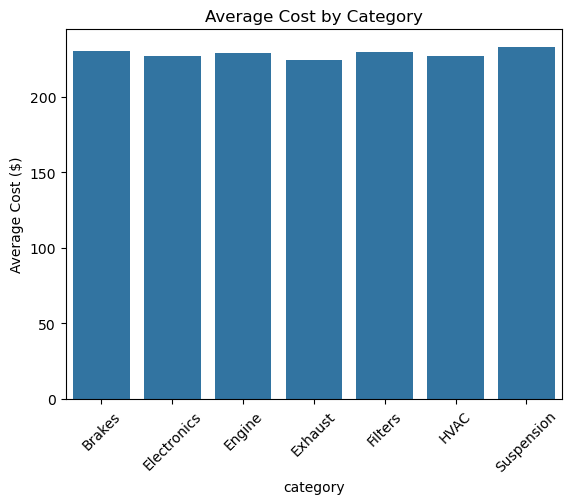
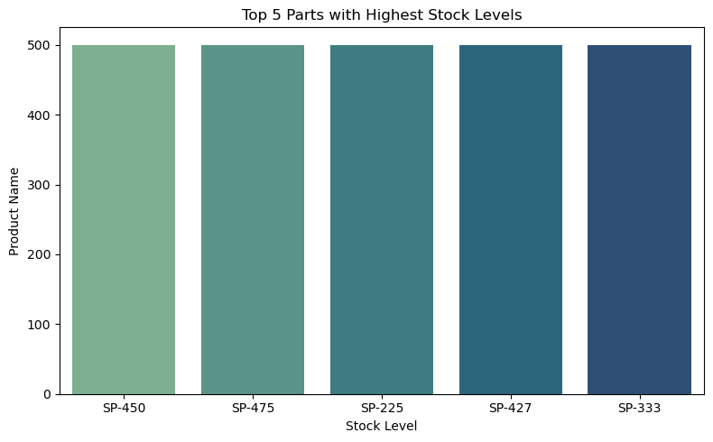
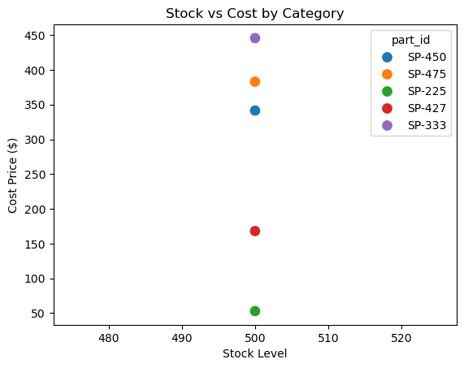
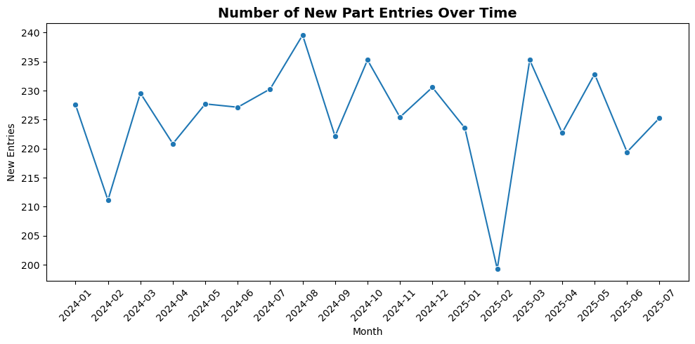
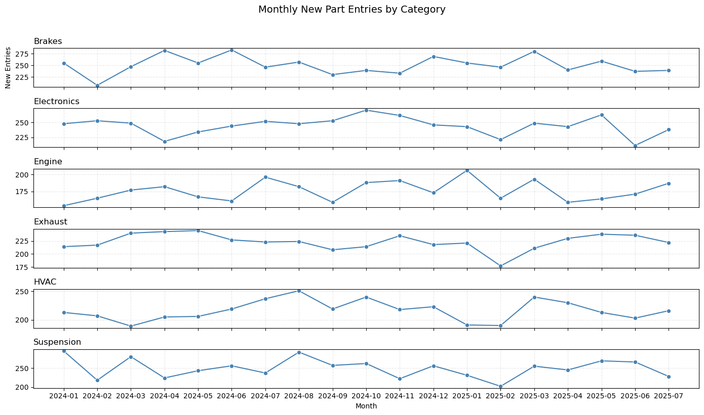

# Project: Supplier Data Integration & Analysis Pipeline

## Objective
Parts Avatar is looking to integrate a new auto parts supplier to expand our inventory. We have received a sample data feed (`supplier_feed.csv`) containing their product stock levels and costs, along with a separate file (`product_metadata.csv`) that maps supplier part IDs to our internal product information.

Our goal is to build a reliable, automated pipeline to process this data, load it into a database, and perform an initial analysis to determine the viability of this supplier.

## The Challenge
The supplier's data feed is notoriously unreliable. It contains inconsistencies, missing values, and mixed data types that must be handled gracefully. Your task is to design and implement a small-scale ETL (Extract, Transform, Load) pipeline that is robust enough to handle these issues and produce clean, analytics-ready data.

## Datasets
* `data/supplier_feed.csv`: The raw, messy data from the new supplier.
* `data/product_metadata.csv`: Maps the supplier's parts to our internal system.


## 1. Data Exploration

Before cleaning, the data was checked for:

- Missing or inconsistent values in `cost_price`, `entry_date`, and `stock_level`
- Mixed formats (e.g., `$25.00` vs `25.00`)
- Multiple date formats (e.g., `2023-10-01`, `10/01/23`, `October 1, 2023`)
- Text-based stock levels such as `"Low Stock"` or `"Unavailable"`
- Duplicate rows

Although the provided dataset had no major issues, these checks ensure the script can handle new or inconsistent supplier data in the future.

---

## 2. Data Cleaning

### Duplicates
- Removed duplicate rows to keep unique records.

### Missing Values
- **`cost_price`** → replaced missing values with the average price for the same `part_id`.
- **`stock_level`** → replaced missing values with `-1` to mark unknown or unavailable items.

### Cleaning `cost_price`
- Removed dollar signs and converted all prices to numeric values.0`

### Standardizing `entry_date`
- Converted all date formats to a single consistent format.
- Unrecognized or missing dates were stored as `NaT`.

### Normalizing `stock_level`
Mapped all text values to numbers for easier analysis:

| Original Value | Mapped Value | Meaning |
|----------------|--------------|----------|
| Low / Low Stock | 1 | Product available but limited |
| Out of Stock | 0 | Product unavailable |
| Unavailable or Missing | -1 | Unknown or not provided |


**Justification:**  
The `stock_level` column contained both numeric and text-based values, which made analysis inconsistent.  
Converting all entries to numeric values creates a uniform and interpretable scale where larger numbers indicate greater availability.  

- **`1` ("Low Stock")** → Item is still available, so it's considered a positive stock condition.  
- **`0` ("Out of Stock")** → Represents no inventory, but a valid product listing.  
- **`-1` ("Unavailable" or missing)** → Marks unknown or missing information, separating it from an actual zero stock.  

This numeric mapping (`-1 < 0 < 1`) simplifies filtering, aggregation, and visualization while preserving the real-world meaning of availability levels.

---

## 3. Database Schema

Created a local SQLite database: `parts_avatar.db`.

### Table: `supplier_feed`
| Column | Type | Description |
|--------|------|-------------|
| part_id | TEXT | Primary key |
| stock_level | INTEGER | Cleaned numeric stock value |
| cost_price | REAL | Numeric price |
| entry_date | TEXT | Standardized date |

### Table: `product_metadata`
| Column | Type | Description |
|--------|------|-------------|
| part_id | TEXT | Primary key |
| part_name | TEXT | Product name |
| category | TEXT | Product category |

Both tables are joined using `part_id`.

---


## 4. Analysis & Findings

### Average Cost Price per Category
- Average prices are consistent across categories (~$225–$230).
- Indicates uniform pricing and stable sourcing.

<p align="center">
    
</p>
<p align="center"><em>Figure 1. Average cost price per category</em></p>

### Top 5 Parts by Stock Level
- Top parts: **SP-450, SP-475, SP-225, SP-427, SP-333** (~500 units each).
- Prices vary widely ($50–$450), showing different capital investments per item.

<p align="center">
  
  
</p>
<p align="center"><em>Figure 2. Stock level distribution and cost comparison across categories</em></p>


### Monthly New Entries
- Around **220–240 new parts** added per month on average.
- **Brakes** and **Electronics** categories show the most frequent updates.
- Stable trend overall, showing predictable supplier activity.

<p align="center">
  
  
</p>
<p align="center"><em>Figure 3. Monthly new part entries (overall and by category)</em></p>

## 6. How to Run

```bash
# Create environment
conda create -n data_env python=3.10 -y
conda activate data_env
pip install -r requirements.txt

# Run data cleaning
python src/transform_data.py

# Run database creating
python src/create_db.py

# to see the visualization result
jupyter notebook notebooks/analyze_visualize.ipynb